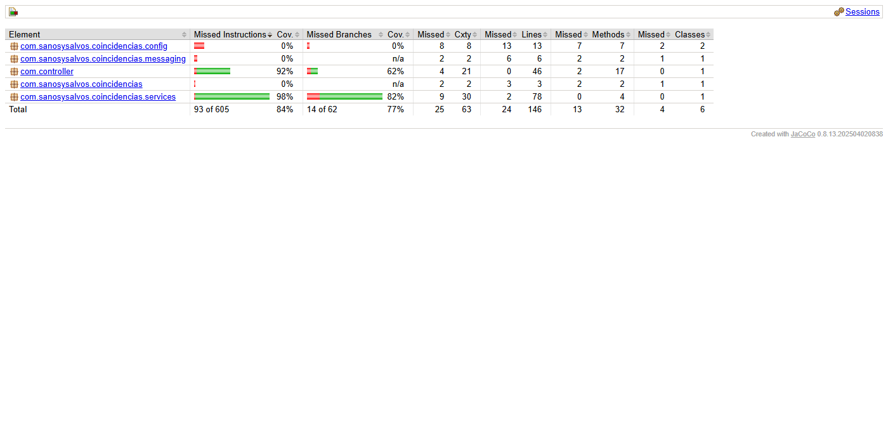
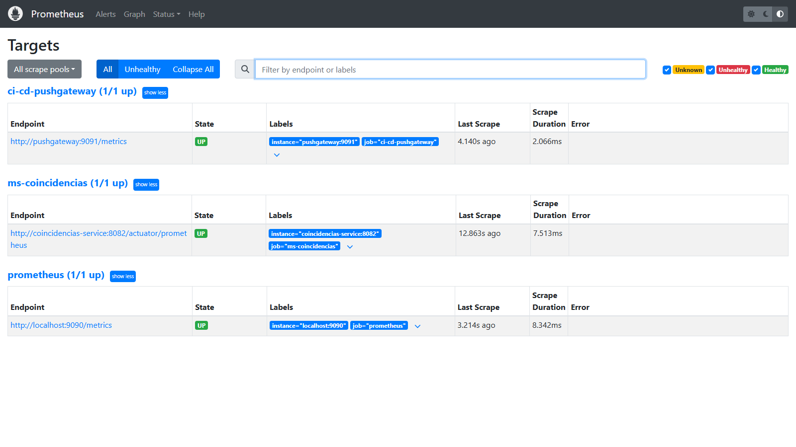
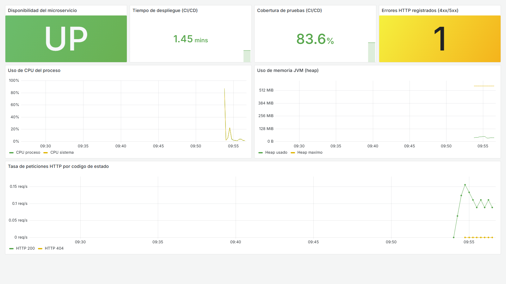
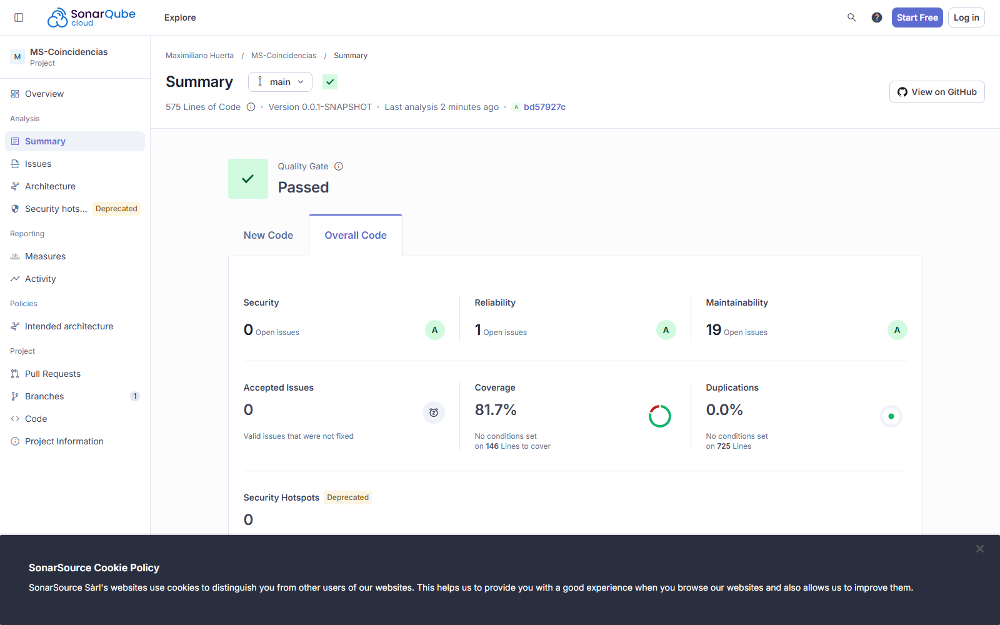
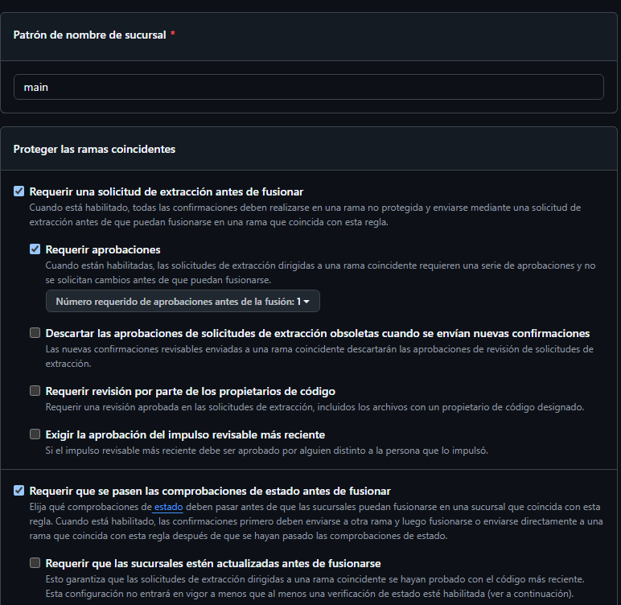
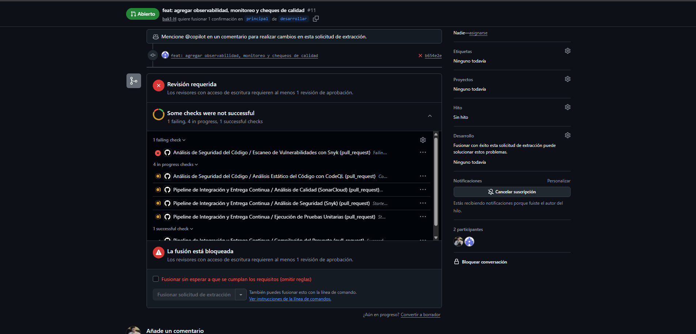

# MS-Coincidencias

**Asignatura:** Ingeniería DevOps
**Integrante:** Maximiliano Arturo Huerta Gonzalez

Este es el microservicio que desarrollé para el ramo. En esta Tercera entrega le agregué toda la parte de observabilidad (monitoreo, métricas y un dashboard) y le sumé chequeos de calidad y seguridad al pipeline. Si quieres ir directo a esa parte, está más abajo en [Parte 2 — Observabilidad, métricas y cumplimiento](#parte-2--observabilidad-métricas-y-cumplimiento).

---

## ¿Qué hace?

MS-Coincidencias se encarga de encontrar coincidencias entre reportes de mascotas perdidas y mascotas encontradas. La idea es la siguiente: cuando entra un reporte nuevo (llega por RabbitMQ), el servicio lo compara contra todos los reportes del tipo contrario que ya existen y les calcula un puntaje. Si el puntaje supera el umbral de 0.60, guardo esa coincidencia en la base de datos y se publica una notificación.

El puntaje se arma sumando varios criterios, cada uno con su peso:

| Criterio | Peso |
|---|---|
| Tipo de mascota | 0.25 |
| Raza | 0.25 |
| Tamaño | 0.15 |
| Proximidad geográfica (Haversine) | 0.20 |
| Color | 0.10 |
| Sexo | 0.05 |

---

## Con qué está hecho

| Tecnología | Para qué |
|---|---|
| Java 21 + Spring Boot 4.0.6 | El microservicio en sí |
| Spring Data JPA | Para acceder a la base de datos |
| Spring AMQP | Para conectarse a RabbitMQ |
| PostgreSQL 16 | La base de datos |
| RabbitMQ 3.13 | La cola de mensajes |
| Docker + Docker Compose | Para contenerizar y levantar todo junto |
| GitHub Actions | El pipeline CI/CD |
| Snyk + SonarCloud | Seguridad y calidad del código |
| Prometheus + Grafana | Monitoreo y dashboard (parte 2) |
| Lombok | Para escribir menos código repetido |

---

## Cómo está organizado el proyecto

```
MS-Coincidencias/
├── .github/workflows/      # el pipeline (ci-cd.yml) y el de seguridad (security.yml)
├── src/
│   ├── main/java/...       # el código del microservicio
│   ├── main/resources/     # application.properties
│   └── test/               # las pruebas unitarias
├── monitoring/             # configuración de Prometheus y Grafana (parte 2)
├── scripts/                # scripts de apoyo (capturas y métricas)
├── docs/screenshots/       # capturas de evidencia
├── Dockerfile              # imagen del microservicio (multi-stage)
├── docker-compose.yml      # levanta todos los servicios juntos
└── pom.xml                 # dependencias Maven
```

---

## El microservicio en Docker

La imagen la armé con un Dockerfile de **dos etapas**: en la primera Maven compila y empaqueta el proyecto, y en la segunda dejo solo el JRE (imagen Alpine, que es más liviana) y copio el `.jar`. Así la imagen final pesa menos.

También configuré un usuario sin permisos de root para correr la aplicación, y un health check para que Docker sepa cuándo el servicio está realmente listo.

Si quieres construirla manualmente:

```bash
docker build -t ms-coincidencias:latest .
```

---

## Las pruebas

Las pruebas las hice con JUnit 5 y Mockito. No necesitan base de datos ni RabbitMQ reales porque uso mocks que simulan esas dependencias, así corren rápido y en cualquier entorno.

| Clase | Qué prueba |
|---|---|
| `CoincidenciaServiceTest` | El algoritmo de puntaje, el umbral de 0.60 y algunos casos borde |
| `CoincidenciaControllerTest` | Todos los endpoints REST: que devuelvan el código HTTP y el JSON correctos |
| `CoincidenciasApplicationTests` | Que la aplicación levante sin errores |

Para ejecutarlas:

```bash
./mvnw test
```

Los reportes quedan en `target/surefire-reports/` y también se suben como artifact en cada ejecución del pipeline.

### Cobertura de las pruebas (JaCoCo)

Para medir cuánto código cubren las pruebas uso **JaCoCo**, que está configurado en el `pom.xml`. El reporte se genera solo al correr las pruebas:

```bash
mvnw.cmd test
```

Después de eso, JaCoCo deja el reporte en `target/site/jacoco/`. El archivo que interesa ver es **`index.html`**, que es la versión visual y navegable. Para abrirlo en Windows:

```cmd
start target\site\jacoco\index.html
```

En esa página se ve el porcentaje total de cobertura y, entrando a cada clase, qué líneas están cubiertas por las pruebas (en verde) y cuáles no (en rojo).



---

## El pipeline CI/CD

Tengo un pipeline en GitHub Actions (`.github/workflows/ci-cd.yml`) que se ejecuta cada vez que hago push o un pull request a `main`. Las etapas van una después de otra, y **si una falla, las siguientes no se ejecutan**:

1. **Compilación** — verifica que el código compile.
2. **Pruebas** — ejecuta las pruebas unitarias.
3. **Seguridad (Snyk)** — busca vulnerabilidades en las dependencias.
4. **Calidad (SonarCloud)** — análisis de código + Quality Gate (esto lo agregué en la parte 2).
5. **Imagen Docker** — construye la imagen y la sube a ghcr.io (solo si lo anterior pasó).
6. **Despliegue simulado** — levanta todo con Docker Compose y verifica que la API responda.

Además del pipeline, también dejé configurado:

- **Dependabot**, que cada semana revisa si hay actualizaciones de seguridad para las dependencias y abre un PR automático si encuentra algo.
- **CodeQL** (`.github/workflows/security.yml`), que analiza el código Java buscando patrones inseguros.

Los resultados de seguridad se ven en GitHub, en la pestaña **Security → Code scanning**.

> Para que Snyk y SonarCloud funcionen, hay que tener cargados los secrets `SNYK_TOKEN` y `SONAR_TOKEN` en el repositorio (Settings → Secrets and variables → Actions).

---

## Levantar todo localmente

Con Docker Compose levanto el microservicio junto con la base de datos y la cola (y en la parte 2 también el monitoreo). Cada servicio tiene health check, y la aplicación espera a que PostgreSQL y RabbitMQ estén sanos antes de arrancar.

```bash
docker compose up --build -d      # levanta todo
docker compose ps                 # ver el estado
docker compose logs -f coincidencias-service   # ver los logs de la aplicación
docker compose down -v            # apagar y limpiar
```

Direcciones útiles del microservicio:

| Para ver... | Dirección |
|---|---|
| La API | http://localhost:8082/coincidencias |
| Health check | http://localhost:8082/actuator/health |
| Panel de RabbitMQ | http://localhost:15672 (guest / guest) |

---

## Endpoints de la API

| Método | Ruta | Qué hace |
|---|---|---|
| GET | `/coincidencias` | Trae todas las coincidencias |
| GET | `/coincidencias/{id}` | Trae una por su ID |
| GET | `/coincidencias/reporte/{idReporte}` | Las coincidencias de un reporte |
| GET | `/coincidencias/perdido/{id}` | La coincidencia de un reporte perdido |
| GET | `/coincidencias/visto/{id}` | La coincidencia de un reporte encontrado |
| DELETE | `/coincidencias/{id}` | Borra una coincidencia |

---

# Parte 2 — Observabilidad, métricas y cumplimiento

En esta segunda parte le agregué al microservicio todo lo relacionado con observabilidad: monitoreo con Prometheus, un dashboard en Grafana, análisis de calidad con SonarCloud y un par de mecanismos en el pipeline para que no deje pasar código inseguro o de mala calidad.

A continuación explico cómo dejé armado el entorno y cómo se puede levantar y probar, por si lo quieren revisar funcionando.

## Cómo levantar el entorno y probarlo

Lo único que se necesita es tener **Docker Desktop** corriendo. Después, ubicado en la carpeta del proyecto:

```bash
docker compose up --build -d
```

Eso levanta 6 contenedores: el microservicio, la base de datos (PostgreSQL), la cola (RabbitMQ), Prometheus, el Pushgateway y Grafana. La primera vez tarda un poco porque tiene que construir la imagen.

Una vez que está todo arriba, estas son las direcciones para entrar a cada componente:

| Para ver... | Dirección | Notas |
|---|---|---|
| La API del microservicio | http://localhost:8082/coincidencias | — |
| Las métricas crudas que expone | http://localhost:8082/actuator/prometheus | — |
| Prometheus | http://localhost:9090 | en /targets se ve qué está monitoreando |
| **El dashboard de Grafana** | http://localhost:3000/d/ms-coincidencias | entra directo, sin login |
| Pushgateway | http://localhost:9091 | — |

> Grafana lo dejé con acceso anónimo para poder ver el dashboard sin necesidad de iniciar sesión. De todas formas, el usuario admin es `admin` / `admin` por si se quiere editar algo.

Si se quiere generar movimiento para ver cómo cambian las gráficas, basta con hacer varias peticiones a la API (por ejemplo, abrir varias veces http://localhost:8082/coincidencias, o pedir un id que no existe para que registre un error). En unos segundos eso aparece reflejado en Grafana.

Para apagar todo al terminar:

```bash
docker compose down -v
```

---

## Monitoreo con Prometheus

Uso **Spring Boot Actuator** junto con **Micrometer** para que la aplicación exponga sus métricas en el formato que entiende Prometheus, en la ruta `/actuator/prometheus`. Prometheus está configurado para ir a buscar esas métricas cada 15 segundos.

Con esto puedo observar:

- Si el servicio está disponible o no (la métrica `up`).
- Las peticiones HTTP separadas por código de respuesta, así se ven los errores (4xx, 5xx).
- El uso de CPU y memoria de la aplicación.

Aquí se ve Prometheus monitoreando correctamente al microservicio (los tres targets aparecen en verde, `UP`):



La configuración está en [`monitoring/prometheus/prometheus.yml`](monitoring/prometheus/prometheus.yml).

---

## El despliegue con Docker Compose

Todo el entorno corre orquestado con Docker Compose. No usé Kubernetes porque todavía no lo hemos visto en el curso, así que quedó todo sobre Compose.

Algunas cosas que cuidé en la orquestación:

- Cada servicio tiene su **health check**, y la aplicación no arranca hasta que la base de datos y la cola estén sanas.
- **Prometheus arranca recién cuando el microservicio ya está healthy**, así no pierde datos al inicio.
- Los datos de Prometheus y Grafana se guardan en volúmenes, para que no se pierdan al reiniciar.

---

## El dashboard en Grafana

Grafana viene configurado automáticamente: cuando levanta, carga el datasource de Prometheus y el dashboard solo, sin tener que tocar nada a mano.

En el dashboard reuní las métricas más importantes en una sola pantalla:

- **Tiempo del último despliegue**
- **Cobertura de las pruebas**
- **Uso de CPU y memoria**
- **Errores HTTP registrados**
- Si el servicio está disponible o no

Así se ve funcionando:



El tiempo de despliegue y la cobertura no son métricas que el microservicio genere por sí solo, así que las envío al Pushgateway con un script pequeño (la cobertura la obtiene del reporte de pruebas):

```bash
# después de ejecutar ./mvnw test, que es el que genera el reporte de cobertura
node scripts/push-cicd-metrics.mjs --deploy-seconds 87
```

El dashboard está guardado como código en [`monitoring/grafana/dashboards/ms-coincidencias.json`](monitoring/grafana/dashboards/ms-coincidencias.json), así que se versiona junto con el proyecto.

---

## Cómo todo esto ayuda a tomar decisiones

La idea de tener todas estas herramientas no es solo que se vean bien, sino que permiten decidir mejor:

- Si **Snyk** o **SonarCloud** encuentran algo grave, el pipeline se frena y queda claro que ese código no debe liberarse.
- Con **Grafana** puedo revisar si la cobertura bajó respecto al despliegue anterior, o si la memoria está subiendo más de lo normal, y a partir de eso decidir si hay que revisar algo.
- Los **errores HTTP** en el dashboard avisan rápido si algo empezó a fallar después de un cambio.

El pipeline está definido en `.github/workflows/ci-cd.yml` y las etapas van encadenadas: si una falla, las siguientes no se ejecutan.

---

## Calidad y seguridad: SonarCloud y Snyk

Para la parte de cumplimiento uso dos herramientas que quedan integradas en el pipeline:

- **SonarCloud** revisa la calidad del código, busca bugs y vulnerabilidades, y mide la cobertura de las pruebas. Tiene un Quality Gate que es el que determina si el código "pasa" o no.
- **Snyk** revisa las dependencias del proyecto buscando vulnerabilidades conocidas.

El proyecto en SonarCloud quedó público, así que se puede entrar a verlo directamente:

**https://sonarcloud.io/dashboard?id=bak1-H_MS-Coincidencias**

Este es el estado actual (Quality Gate en *Passed*, cobertura 81.7%, y las tres notas en A):



Además, la rama `main` quedó protegida en GitHub: no se puede hacer push directo, hay que pasar por Pull Request y que los chequeos del pipeline estén en verde antes de poder mergear.

| Plataforma | Enlace | Acceso |
|---|---|---|
| SonarCloud | https://sonarcloud.io/dashboard?id=bak1-H_MS-Coincidencias | Público |
| Snyk | https://app.snyk.io/invite/link/accept?invite=1b4017bc-adf5-4bb5-a83a-547294208f4f&utm_source=link_invite&utm_medium=referral&utm_campaign=product-link-invite&from=link_invite| Invitacion |

---

## Reglas para la rama Main



---

## El pipeline se frena si algo está mal

Una de las cosas que pedía esta parte era demostrar que, si aparece una falla crítica de seguridad o calidad, el pipeline se detiene y no llega a desplegar. Eso lo conseguí con dos chequeos:

- **Snyk** se ejecuta con `--severity-threshold=high`, así que si encuentra una vulnerabilidad alta o crítica, ese paso falla.
- **SonarCloud** se ejecuta con `sonar.qualitygate.wait=true`, que hace que el pipeline espere el resultado del Quality Gate y falle si no pasa.

Como el paso que construye y publica la imagen de Docker depende de que las pruebas, Snyk y SonarCloud terminen bien, si cualquiera de los tres falla **la imagen nunca se construye ni se despliega**.

Para demostrarlo:



---

## Conclusiones y reflexión personal


En esta entrega aprendí que, en un entorno de desarrollo real, las herramientas de monitoreo y seguridad cumplen funciones mucho más importantes de lo que pensaba al principio. Antes las veía como algo opcional o secundario, pero ahora entiendo que son las que te dan visibilidad sobre lo que realmente está pasando con la aplicación.

Por el lado del monitoreo, trabajar con Prometheus y Grafana me hizo ver lo útil que es tener las métricas a la vista en un solo lugar. Con Actuator y Micrometer la aplicación expone datos como el uso de CPU y memoria, la disponibilidad del servicio y los errores HTTP, y Grafana los muestra de forma que se entienden de un vistazo. Eso cambia la manera de tomar decisiones: en vez de adivinar, puedo mirar el dashboard y darme cuenta si algo está fallando o si un cambio empeoró el rendimiento.

Por el lado de la calidad y la seguridad, SonarCloud y Snyk me mostraron que se puede medir cosas que antes daba por sentadas. SonarCloud analiza la calidad del código y la cobertura de las pruebas, y Snyk revisa las dependencias buscando vulnerabilidades conocidas. Sumándole JaCoCo para la cobertura, terminé teniendo una idea bastante clara de qué tan sano está el proyecto.

Lo que más me quedó es la idea de que estas herramientas no sirven solo para "mostrar números", sino para frenar a tiempo. Configurar el pipeline para que se detenga cuando Snyk o el Quality Gate de SonarCloud encuentran un problema crítico me hizo entender que la automatización también sirve para protegerte de subir código inseguro o de mala calidad sin darte cuenta. En resumen, esta parte me dejó claro por qué la observabilidad y el cumplimiento son tan importantes en DevOps y no algo que se agrega al final solo por cumplir.
